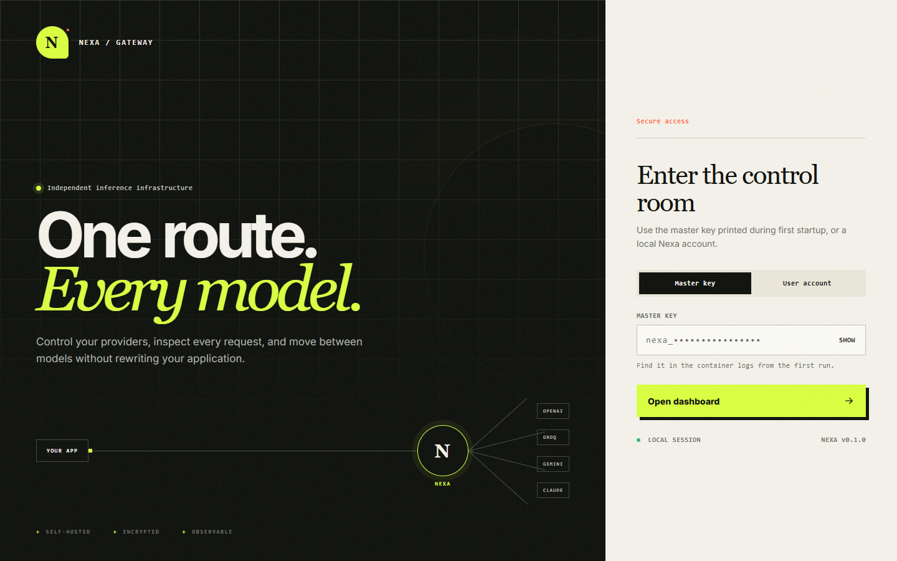
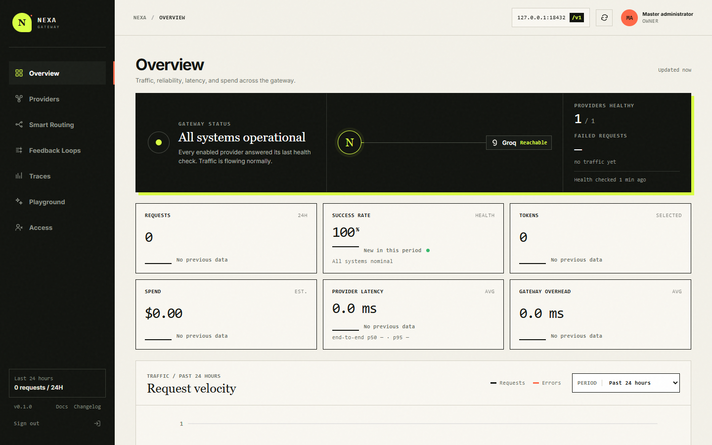
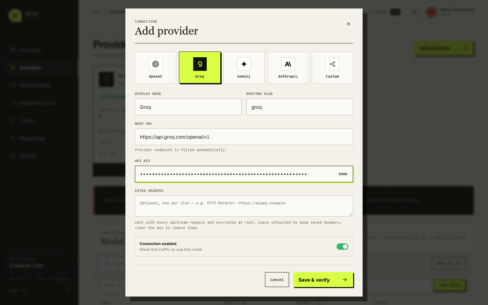
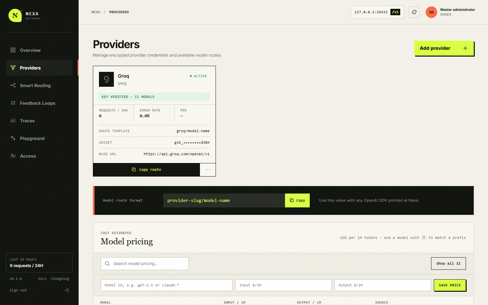
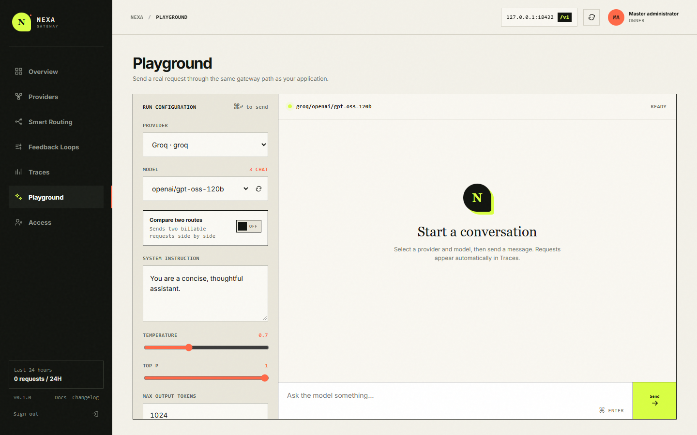
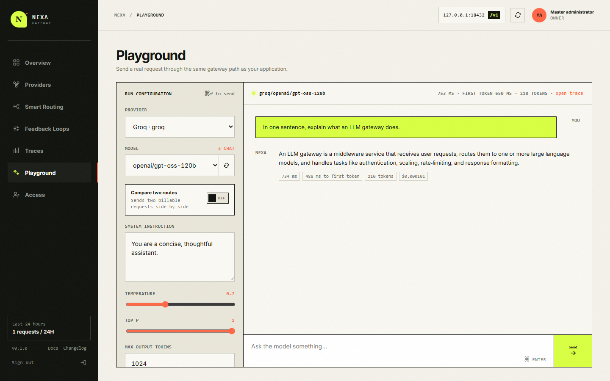
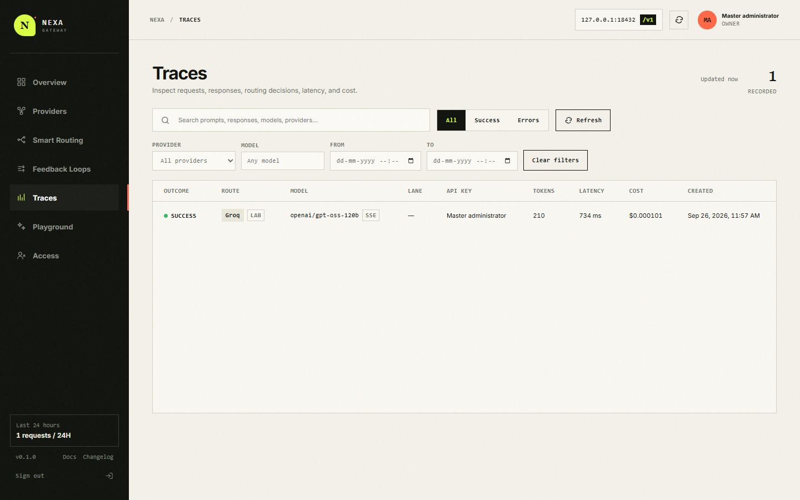

# Nexa Gateway

**A self-hosted control room for LLM providers.** Nexa Gateway runs as one Go service with a built-in dashboard. Add a provider, choose a model in the Playground, send a prompt, and inspect the resulting trace. This guide covers that complete workflow on your own computer.

> This getting-started guide uses the dashboard **Playground**. Nexa also exposes an OpenAI-compatible API and includes smart routing and feedback loops; those workflows are outside this guide.

## What it does

```text
Your browser → Nexa Playground → Nexa gateway → LLM provider
                                 ↘ request trace in local storage
```

The Playground sends real requests through the gateway. Nexa uses the selected provider's credential, returns the model's answer, and records the prompt, response, status, tokens, latency, and estimated cost in **Traces**. The dashboard, Go server, SQLite database, and encryption key run locally; the selected provider receives your prompt when you press **Send**.

| Part | Role |
| --- | --- |
| **Master key** | Owner credential created on first startup. Use it to sign in. |
| **Provider API key** | Credential issued by OpenAI, Groq, Gemini, Anthropic, or a compatible provider. It is separate from the master key. |
| **Provider connection** | A named, enabled route with a provider type, URL, and encrypted API key. |
| **Playground** | Dashboard chat interface for choosing a connected provider and model and making real requests. |
| **Trace** | Local record of one request, including its result and performance details. |

## Before you start

- Install and start **Docker Desktop**, or another Docker Engine with the Compose plugin.
- Install **Git** to clone the repository.
- Obtain an API key from at least one supported provider's developer console. Nexa does not generate provider keys. The screenshots use Groq; the same flow works with other provider choices.
- Allow Docker to reach the provider over the internet. The dashboard itself is served locally.

Provider calls may be billed or rate limited by your provider. **Compare two routes** makes two requests per prompt.

## 1. Install and start

Open a terminal and run:

```bash
git clone https://github.com/data-guru0/LLM-GATEWAY.git
cd LLM-GATEWAY
docker compose up --build -d
```

Compose builds the image, starts the `nexa-gateway` service, maps port **8080**, and creates a persistent Docker volume named `nexa-data`. There is no separate database to install.

Check its status with `docker compose ps`, then open **<http://localhost:8080>**. If the page does not load immediately, inspect `docker compose logs nexa-gateway`.

### If port 8080 is in use

Set `NEXA_PORT` before starting Compose:

```powershell
# PowerShell
$env:NEXA_PORT = "18080"
docker compose up --build -d
```

```bash
# macOS / Linux
NEXA_PORT=18080 docker compose up --build -d
```

Then use **<http://localhost:18080>**. The screenshots were taken from an isolated local instance on port 18432; the normal Compose setup uses 8080 unless you change it.

## 2. Get the master key and sign in

On its **first startup with a new data volume**, Nexa prints a master key in the container logs:

```bash
docker compose logs nexa-gateway
```

Find the **NEXA GATEWAY · FIRST START** box:

```text
NEXA GATEWAY · FIRST START
Master key: nexa_<your-unique-key>
Save it now. It will not be printed again.
```

Copy the actual `nexa_...` value to a password manager. Nexa does not print it on later starts with the same volume. Keep it out of screenshots, issues, and commits.

In the browser, keep **Master key** selected, paste the key into **MASTER KEY**, and click **Open dashboard**.



**Overview** is the landing page. Its request metrics become useful once you send prompts.



## 3. Add and verify a provider

1. Click **Providers** in the sidebar, then **Add provider**.
2. Choose **OpenAI**, **Groq**, **Gemini**, **Anthropic**, or **Custom**.
3. Enter a **Display name**, such as `Groq`. The **Routing slug** is filled from the name; it is the short identifier in model routes.
4. Leave the prefilled **Base URL** for a built-in provider unless your provider requires another endpoint. For **Custom**, enter its OpenAI-compatible API base URL.
5. Paste the **provider's API key** into **API KEY**. This is the key from the provider's console, not the Nexa master key.
6. Leave **Connection enabled** on and click **Save & verify**.



Nexa saves the credential encrypted and attempts to fetch the provider's model list. A successful card shows **KEY VERIFIED** and a model count. The key stays masked when you view the connection later.



**KEY VERIFIED** means model discovery worked. The first Playground request checks that the selected model can answer. If the card says **CHECK FAILED**, confirm the provider key, account access, base URL, and internet connection. You can edit the connection from its **⋯** menu.

## 4. Send your first Playground prompt

1. Click **Playground** in the sidebar.
2. Choose the connected **Provider**. Only enabled providers appear.
3. Choose a **Model** from the chat-capable model list. Use the refresh button beside **Model** if you just changed the provider or its available models.
4. Keep the default settings for your first test. Type a short prompt, such as `In one sentence, explain what an LLM gateway does.`
5. Click **Send**, or press **Ctrl+Enter** on Windows/Linux or **⌘+Enter** on macOS.



The answer appears in the conversation area. The bar above it shows the selected route and request metrics; the answer also shows elapsed time, token usage, and estimated cost when available.



The dashboard saves the conversation in that browser's local storage, so reopening the page can restore it. **Clear conversation** clears the chat and its browser copy; it does not delete server-side traces.

### Playground controls

| Control | What it does |
| --- | --- |
| **System instruction** | Adds an instruction before the conversation, such as a desired role or response style. |
| **Temperature** | Adjusts sampling where supported. Nexa disables it for OpenAI reasoning models that set their own temperature. |
| **Top P** | Sets nucleus sampling when changed from its default of 1. |
| **Max output tokens** | Sets the response token limit; the default is 1024. |
| **Stop sequences** | Optional comma-separated strings that tell the model where to stop. |
| **Stream response** | Shows text as it arrives. On by default; **Stop** cancels an in-progress request. |
| **JSON mode** | Requests one JSON object. Describe desired fields in your prompt; Nexa adds a short JSON instruction if needed for OpenAI or Groq. |
| **Compare two routes** | Chooses a second provider/model and shows both answers side by side. Each prompt makes two billable requests. |
| **Clear conversation** | Clears the visible chat and saved browser conversation. |

Valid parameters can vary by provider and model. If a request fails, the error appears in chat; open its trace for detail.

## 5. Inspect the request in Traces

Click **Traces** after sending a prompt. The new row shows the outcome, provider and model, token count, latency, cost estimate, and time. Search or filter for an older request, then click a row to inspect its prompt, response, request timeline, and other details.



You can also click **Open trace** above a completed Playground answer. Traces are retained for **90 days** by default. Cost is an **estimate** based on Nexa's built-in prices or prices entered under **Providers → Model pricing**; the provider's bill is authoritative.

## Daily operation

| Task | Command, run from the repository directory |
| --- | --- |
| View service status | `docker compose ps` |
| View recent logs | `docker compose logs --tail=100 nexa-gateway` |
| Follow logs | `docker compose logs -f nexa-gateway` |
| Stop the gateway | `docker compose down` |
| Start it again | `docker compose up -d` |
| Rebuild after pulling changes | `git pull && docker compose up --build -d` |

`docker compose down` removes the container but **keeps** the `nexa-data` volume. That volume contains the SQLite database and `secret.key`, which encrypts saved provider credentials. Keep those files together when backing up or moving an instance. Deleting the volume removes configuration and traces; a new volume creates a new master key.

### If you lose the master key

If still signed in as the owner, go to **Access → Master key → Rotate master key**, then save the new value shown once.

If you cannot sign in, stop the service and reset the key using the existing volume:

```bash
docker compose stop nexa-gateway
docker compose run --rm nexa-gateway -reset-master
docker compose up -d
```

The reset command prints the replacement once. It invalidates the old master key and signs out other master sessions; it does not remove providers or traces.

## Troubleshooting

| Symptom | Check |
| --- | --- |
| **Dashboard does not open** | Confirm Docker is running with `docker compose ps`; inspect `docker compose logs nexa-gateway`; check whether port 8080 is occupied. |
| **No master key in logs** | The volume probably already existed. Use the saved key or reset it as described above. |
| **Provider shows CHECK FAILED** | Recheck the provider-issued API key, base URL, account permissions, and Docker internet access. Save the connection again to retry. |
| **Provider is missing in Playground** | Enable it on its Providers card. |
| **No chat models appear** | Click model refresh. Check whether the provider returned any chat-capable models and whether verification succeeded. |
| **Playground request fails** | Read the chat error, then open its trace. Check provider authorization, quota, model access, and request parameters. |
| **Cost looks wrong** | Check the model's entry under **Providers → Model pricing**. Nexa's cost is an estimate. |

## Data and security notes

- The master key is shown only when created or rotated. Provider API keys and extra headers are encrypted at rest; dashboard sessions use HTTP-only cookies.
- Keep the dashboard on a trusted machine or network. For an internet-facing deployment, put HTTPS in front of Nexa and add `NEXA_SECURE_COOKIES: "true"` to the service's `environment` in `docker-compose.yml`.
- Compose persists data in `nexa-data`. The container stores it at `/data`; a native run defaults to `./data`.
- Traces may contain prompts and responses. Give dashboard access only to people who should see that content.

Application code, Docker configuration, and the embedded dashboard live in this directory. The sibling `TESTING/` directory contains black-box verification tooling.
